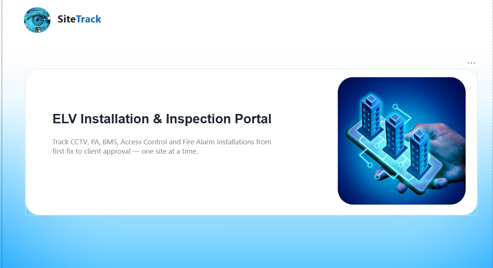
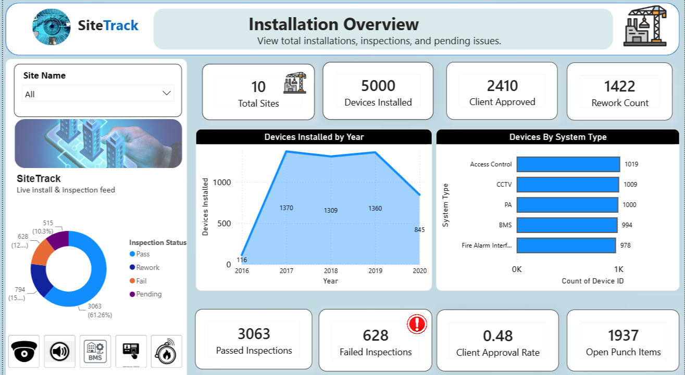
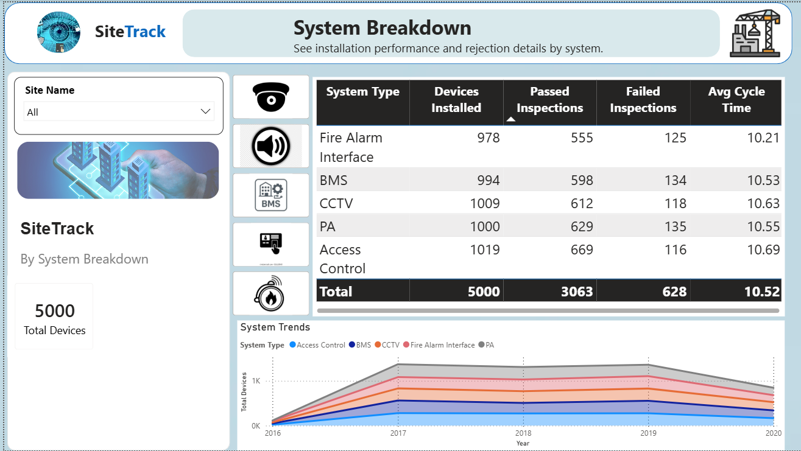

#  ELV System Installation Dashboard

##   Project Overview

This Power BI dashboard provides a complete view of ELV system installation activities across multiple sites. It helps management track project progress, analyze system performance, and monitor technician productivity.

##  Tools Used
- Power BI
- Power Query
- DAX
- Excel

  # 🏗️ Data Modeling

The project follows a **Star Schema data model** to improve reporting performance and maintain a structured relationship between installation data.

### Model Design:

**Fact Table**
- Fact_Installation
  - Installation Records
  - Install Date
  - Site ID
  - System ID
  - Technician ID
  - Installation Status

**Dimension Tables**
- Dim_Date → Date analysis
- Dim_Site → Site details
- Dim_System → ELV system information
- Dim_Technician → Technician details
- Dim_Contractor → Contractor information

### Modeling Approach:
- Created relationships between fact and dimension tables
- Built calculated measures using DAX
- Used Date table for time-based analysis
- Optimized dashboard performance using a structured model

(Add Data Model Screenshot Here)

#  Dashboard Pages

##   Home Dashboard
Provides a quick summary of overall installation status using key KPIs.

**Answers:**  
*"What is the current project status?"*

---

##   Overview Dashboard
Tracks installation progress across different sites and helps identify completion status.

**Answers:**  
*"Are projects progressing as planned?"*

---

##  Systems Dashboard
Analyzes installation performance based on different ELV systems.

**Answers:**  
*"Which systems need more attention?"*

---

##   Technician Performance Dashboard
Monitors technician contribution and productivity.

**Answers:**  
*"Who are the top performers?"*

---

#   Business Benefits

- Tracks installation progress  
- Monitors technician productivity  
- Provides system-level insights  
- Supports faster decision making  

##   Outcome

This dashboard converts installation data into meaningful insights, helping management improve project monitoring and resource planning.

